# Virtuoso

A FeedBack plugin that turns scales, arpeggios, technique, and grooves into **practice routines you actually want to run** — and plays them back in its own DAW-style player with a real-sounding backing band.

**Most practice apps teach you _songs_. Virtuoso teaches you the _skills_** — the gallop, the ii–V–I, the one-drop — so what you build here you take off the screen into your own playing. Pick a routine, set a tempo, hit Play, and drill.

> **Practice the skill, not the song.** Virtuoso is a practice & learning tool, not a song/riff generator — generated routines exist to teach a move, then get out of your way.

Install drops it into FeedBack and it shows up in the nav as **Virtuoso**: pick a routine, hit Play, and you're drilling in under a minute.

<p align="center">
  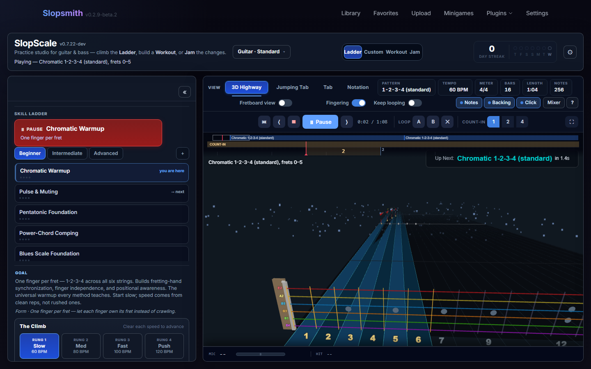
  <br><sub><i>The DAW-style shell — pick a routine, set a tempo, and drill on the 3D Note Highway (or Tab / Notation).</i></sub>
</p>

## Why Virtuoso

- **No song to unlock — drill the exact thing you're stuck on.** It generates the scale, arpeggio, or lick at any position, key, and tempo. No library, no waiting for the right tab.
- **A backing band that doesn't sound like MIDI.** Sampled comp, bass, and drums voiced to the chord — real feel to play *to*, not a metronome with chords.
- **Skills that transfer.** Every routine names the move it teaches, so you leave with vocabulary you own — not muscle memory for one song.
- **DAW-grade control, no subscription.** Loop, slow down, mix, retune — the controls a practising player actually wants. Rides your FeedBack install; no separate sign-up.

## What it is

One **DAW-style shell with four modes**, all sharing the same player, ruler/transport, mixer, and render stage — no second window, nothing to relearn between modes:

- **Ladder** — curated, sequenced routines that build a skill from the ground up; the **Skill Ladder** picker groups them into bands from beginner foundations to advanced / idiom packs.
- **Custom** — full manual control: pick the exact scale, shape, position, meter, progression, and feel you want to drill. Any Custom setup can be saved as a preset or dropped into a Workout.
- **Workout** — a timed, multi-block practice session ("woodshed N minutes"): warm up, target a weak skill, then apply it — built from the same Ladder / Custom units, run back-to-back on a wall clock.
- **Jam** — pick a style, hit one button, and play along immediately over a looping backing band. **Jam is a mirror, not a judge** — no score, no rank; instead the live fretboard strip lights up the current chord's tones / guide tones so the jam *teaches* you what to reach for.

<p align="center">
  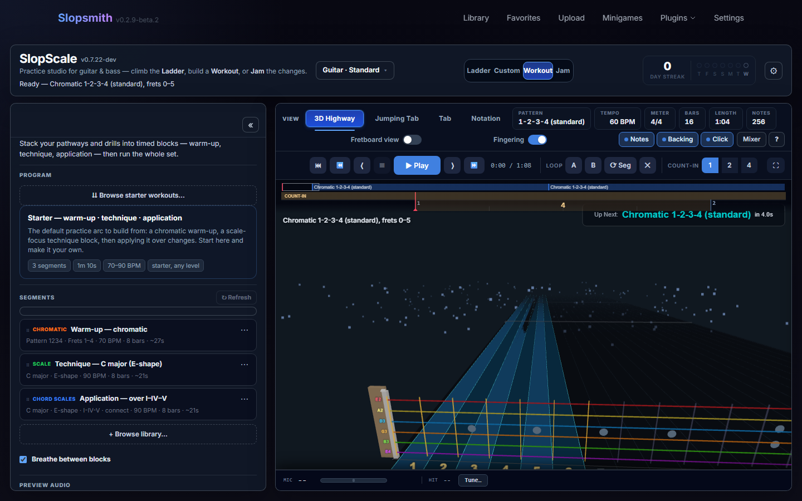
  &nbsp;
  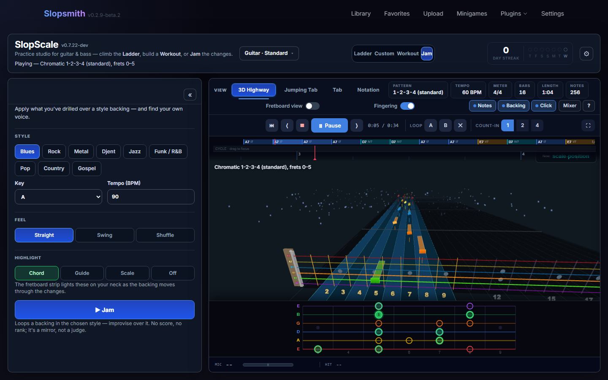
  <br><sub><i>The two newest pillars — <b>Workout</b> (timed woodshedding) and <b>Jam</b> (play along while the fretboard strip lights up the tones to reach for — a mirror, not a judge).</i></sub>
</p>

### Play the changes <sub><i>(new in v0.6.0)</i></sub>

For chord-scale practice, the line now **moves through the changes musically** instead of restarting on each chord — pick how much harmony you're navigating, beginner to bebop, on one dial:

- **Park** — stay in one scale, accent the chord tones as they pass.
- **Connect** — the scale follows the chord and your line **voice-leads into each change's nearest guide tone (3rd/7th)** rather than resetting to the root; common-tone pivots and half-step resolutions fall out naturally.
- **Connect + approach tones** — adds the classic **bebop chromatic enclosure** (a note above + a note below) leading into every change.

<p align="center">
  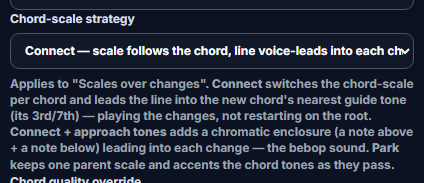
</p>

### Deeper Workouts, strumming & bass <sub><i>(new in v0.7.0)</i></sub>

The Workout pillar got a much bigger library and two new corners of practice:

- **23 starter Workouts** spanning goal × level × genre × instrument — guitar **and** bass — each a warm-up → technique → application arc you can run as-is or make your own.
- **Strumming / comping** — a new practice type: hold a real chord grip and drill the strum hand across folk / pop / funk / rock feels.
- **Bass groove vocabulary** — the root–5th–octave box, octave groove, the 16th-note dead-note pocket, slap & pop, and right-hand technique — sequenced groove-first, the way bass is actually learned.
- **A Depth Ladder** above the tempo climb — prove a skill in a *new key* (the Travel axis) — with an XP readout that's **gained-only and never gates** (Off / Casual / Hardcore).

### A Skill Ladder that goes deep <sub><i>(new in v0.7.2)</i></sub>

The **Ladder** picker grew from a handful of routines into **~80**, grouped into opt-in **packs** you add from the **`+` Pack manager** — so the list stays a curriculum map, not a wall to scroll. Three Core bands (Beginner → Intermediate → Advanced) are always on; everything else you switch in when you want it:

<p align="center">
  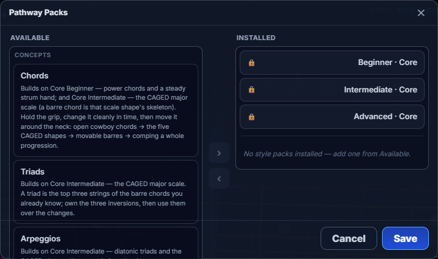
  <br><sub><i>The <code>+</code> Pack manager — opt-in packs grouped by family (the Concepts ladders shown), each routine naming the skill it builds; the Core bands stay installed, and genre / bass packs slot in when you want them.</i></sub>
</p>

- **8 Concept ladders** — one skill, sequenced easy → mastery: **Triads, Arpeggios, Guide Tones, Fretboard Freedom, Expression, Rhythm, Picking, Legato.** Each is a vertical climb through a single idea (Fretboard: one box → CAGED links → position shifts → 3NPS → whole-neck map) rather than another grab-bag.
- **Deeper genre packs** — **Blues** (box → shuffle → bends → call-and-response → mixing major/minor), **Rock** (power + backbeat → pentatonic → lead vocab → pedal riffs → ♭VII changes), **Country** (major pentatonic → cowboy changes → double-stops → chicken pickin' → pedal bends → train beat), alongside the existing **Metal / djent** pack and the community-seeded **Fingerstyle** pack (p-i-m-a + the spider trio) — a genre ladder is the *application* layer: take the grammar into a style's accent.
- **A bass-native ladder** — **Bass Foundations** on a 4-string, groove-first the way bass is actually learned: root–5th–octave → octave groove → dead-note pocket → walking bass → slap & pop. The picker is now **instrument-aware** — guitar-only shapes hide on bass, and the reverse.
- **Own your time** — the Rhythm ladder runs subdivisions → the 16th pocket → swing → displacement → **odd meters** → an **"Over the Barline"** metric-superimposition capstone, plus a **herta** burst drill in the Picking ladder. And Division now **follows your meter** — a quarter-note pick in 7/8 auto-bumps to the felt eighth pulse, with a caption that *names* the cross-pulse instead of letting it feel like a bug.

### Note detection that just works, and a real djent climb <sub><i>(new in v0.7.3)</i></sub>

- **Scoring fixed on current FeedBack** — an internal audio conflict was silently disabling note detection. Fixed: the tuner, grading, and new **per-note hit/miss gems on the 3D Highway** light up as you play (mic on).
- **The djent ladder** — the Metal pack deepens from one advanced rung into a climb: **Low Chug Lock → Accent the Grid → Chug & Stab (grouping cells) → Skip & Gallop → Moving Power-Chord Chug**, topped by a trade-bars **Lock the Cell** jam capstone — plus **"The Breathe"** Workout (the clean ↔ heavy dynamic arc) and drop-A / 8-string floors on tap. The riff is the rhythm; every rung names the device honestly (a 3+3+2 cell is a *grouping* — true polymeter stays the summit).
- **The Chords concept ladder** — open cowboy grips → the five CAGED shapes → barre chords → comping whole progressions → 7th/9th colour grips.
- **The Rhythm ladder grows** — the gallop family (gallop / reverse / skip / snap) as one-note cells, accent displacement, the single-string pulse (tresillo and clave ride it), half/double-time, the reggae skank, and a **Trade Bars** make-your-own-groove capstone. The pure-time rungs adapt to bass automatically.
- **The screen stays awake** during playback — no more display sleep mid-drill.

### Scoring you can trust — and a band that actually comps <sub><i>(new in v0.7.4)</i></sub>

- **Chords score for real.** With the note_detect plugin installed, a polyphonic verifier judges chords and double-stops — the project's first external contribution (thanks, byrongamatos). Without it, chords are honestly *shown, not judged*. Either way, the silent ~33% accuracy cap on chord drills is gone.
- **Timing judging rebuilt to be fair.** Per-note windows that mirror FeedBack's own grader, mic-latency compensation that **self-calibrates to your setup**, and a hit commits on one clean detection. Muted ghost notes aren't misses (the mute IS the technique), bends aren't judged at the unbent pitch, and what can't be fairly judged — too-fast bursts, slurred notes, pitches below the mic's floor — is **disclosed and excluded**, never counted against you.
- **Strictness is a dial you own.** Virtuoso now inherits the host tuner's timing sliders (Clean Timing / chord window) — loosen once in note_detect's settings and every drill follows. Pitch stays ±50 cents: the judge got *correct*, not lenient.
- **See every hit.** Hit paint on Tab, notation, the 2D highway, and the fretboard strip; the 3D Highway shows its native hit/miss marks with ±ms / ±¢ labels. The end-of-run card leads with the verdict, shows rung progress inline, explains *how the run was judged* in plain language, and keeps a standing **"Best here"** target with challenge CTAs ("Take it to 88 ▸").

<p align="center">
  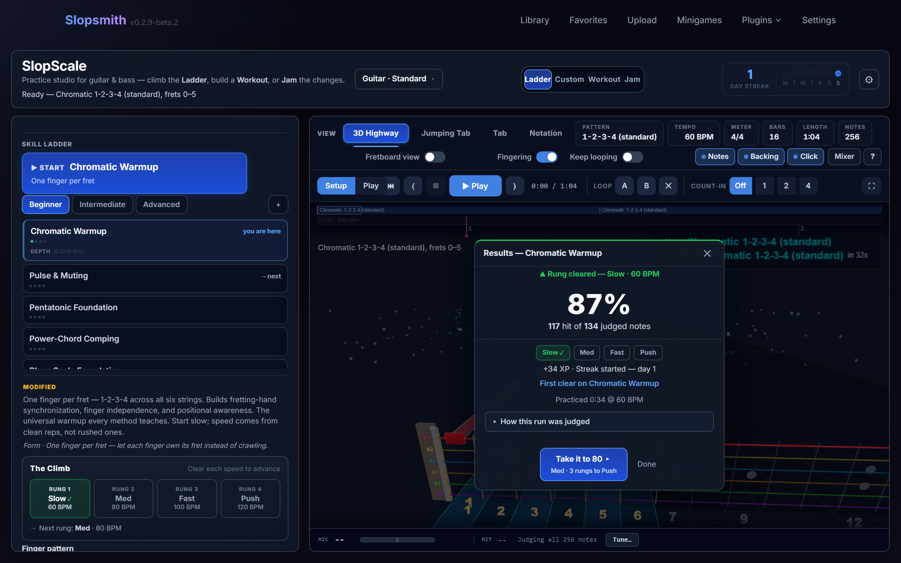
  <br><sub><i>The end-of-run card: verdict first, an honest judged count, your climb inline — and the dare to take it faster. Every exemption is named under "How this run was judged."</i></sub>
</p>
- **A real transport.** Dedicated Stop beside Play/Pause (Space) — pause freezes the clock in place. The LCD tempo is click-to-edit, and between runs the pitch strip stays live with a **target-aware tuner** (per-string chips that lock green).
- **Hands on the chart.** Optional pick-stroke (⊓ / ∨) and fingering marks on Tab, notation, and the strip — driven by per-genre stroke *policies* (alternate, economy, gypsy rest-stroke, bluegrass, metal's all-downstrokes-until-170-BPM wall); bass gets honest i–m plucking letters with rakes and slap/pop. One quiet form cue per rung — and flipping the marks **off** is how you prove a rung clean.
- **Your tuning is law.** Your instrument and tuning are a durable setting; technique rungs anchor to *your* lowest string and derive the key from it — drop-A players stop getting standard-tuning homework.
- **The backing band learned to comp — and hired a bassist.** Re-articulated comp cells replace the held pad (a Charleston under swing, offbeat stabs under a shuffle), chords voice-lead like a comper's hand, and a real bass lane lands the root on beat 1 with the kick — a **generated walking bass** under jazz, the boogie bass in its true octave. On bass, *you* are the bassist: the backing mutes its own. And long Workouts no longer freeze at Play.

### Your Workout became a practice gym — and bass got a pocket to prove <sub><i>(new in v0.7.22)</i></sub>

The biggest batch yet. The **Workout** pillar grew from "a timer over your drills" into a **practice gym** that measures and remembers; **bass** became a first-class path with a way to *prove feel*; and the judge got honest on a real DI rig.

**The Workout remembers what you did** — a gym, not a stopwatch:

- **Per-block measurement** — the end-of-Workout **recap** lists every block as a chapter (played ● / touched ○ / unreached —), gated so a DI-less or mic-less player is never shamed, with a quiet per-block **seam verdict** between blocks.
- **A woodshed log** — time on the instrument, this week, practice days, and a **Woodshed level** that climbs with the hours; **"Your numbers"** keeps the clean tempo to beat for each skill, and **Travel** counts the keys you've held it in.
- **Save your routine** — any Workout you build becomes a named, returnable object: "My morning warm-up" is yours to load next session. Plus length presets and a tempo-locked breath between blocks.
- **A forgiving streak** — survives a single rest day; two in a row ends it, and coming back is celebrated, not punished.
- **Visible XP, levels & competency badges** — earned for naming a *skill* ("It Travels", "Up to Speed"), never for rounds or rank — and the **whole layer flips off** with one switch if you'd rather just practise. Reward is a readout, not a trophy.

<p align="center">
  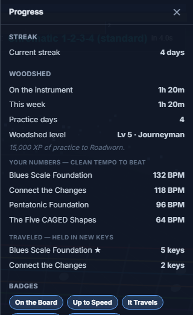
  &nbsp;
  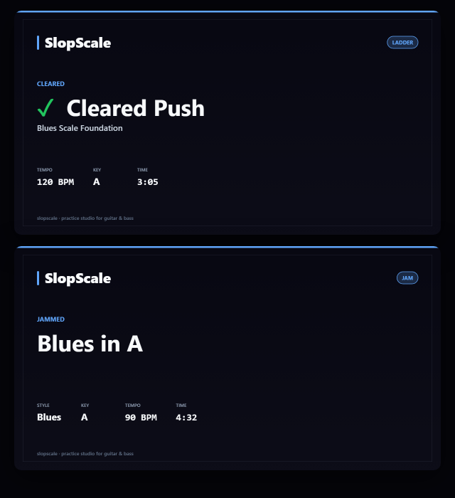
  <br><sub><i>The practice-gym readout — woodshed level, your clean-tempo PBs, keys traveled, and competency badges — beside a <b>copy-as-image share card</b> (a state you reached, never a rank).</i></sub>
</p>

**Bass got a pocket to prove** — now a first-class, instrument-aware path:

- **An instrument-aware bass Core** parallel to the guitar Core, plus new **bass ladders** (foundations + a technique gym) and a **sweep-picking** ladder; the picker hides guitar-only shapes on bass and vice-versa, and your instrument/tuning persists.
- **Felt-hold** — bass *feel* can finally be **cleared**, not just practised. A qualitative pocket verdict — **Locked / Settling / Dragging / Rushing** — reads your timing spread and trend (no new DSP) and logs the tempo you held *Locked*. It's a word, not a leaderboard: "Locked the pocket" is a state, never a rank.
- **Honest right-hand work** — the 1-2-4 fretting doctrine and pinky-legato display, sequenced the way bass is actually learned, plus a corrected walking-bass approach.

**Grading you can trust on a real rig** — two judging P0s, both straight from dogfooding:

- **Sustained / DI playing scores now.** The grader mirrors the host's one-way level veto instead of demanding a fresh attack on every note — a compressed DI or a held note stops getting silently rejected after the first hit.
- **A Workout plays once and ends.** Notes stopped reading as "hits" when you weren't playing and the counter stopped freezing mid-session — a Workout now runs once, ends, and shows the recap.

**Share what you cleared** — copy your scorecard as an **image**, on every lane (Ladder, Custom, Workout, Jam), to drop into Discord or a text. Cooperative and honest: it shows the skill and the state you reached, never a score to beat.

**And some polish** — the Setup/Play pill became a tidy **`«` collapse icon** that widens the stage (and now scales cleanly across window sizes), the inspector panels **slide** instead of snapping, and a fretboard-render regression is fixed.

### Plug into an amp — and the community wrote a ladder <sub><i>(new in v0.7.23)</i></sub>

The guide track became a real guitar through a real rig, the first community-contributed pack landed, and the most-requested djent figure got built *right*:

- **A real guitar guide voice, through an amp.** The line you play along to is now a **sampled electric guitar (DI)** by default — and the Mixer's Guide and Rhythm strips grew an **Amp** row: **Clean / Overdrive / Metal**, three designed amp+cab presets that work across every exercise, Workout and Jam. Auto puts the DI through the Clean amp so it always sounds like an instrument, not a beep; pick Metal and your djent drills finally *sound* like djent. (Acoustic styles keep their steel-string, and bass keeps its bass.)
- **The Fingerstyle pack** — the first **Acoustic & Fingerstyle** band, seeded by a beta tester's own teacher-handed warmup: name the picking hand (**p-i-m-a Foundation**, broken chords over open grips with honest per-note finger letters), then the three **spider** rungs — a two-string crossing drill where every note swaps strings and everything rings, graded *adjacent strings → a skip → full width* ("if you like pain"). Straight from the Discord thread to the Ladder — switch it on from the `+` Pack manager (it's an opt-in pack, like the genre ladders).
- **The Herta Chug.** The relentless modern-djent figure — a sixteenth, two thirty-seconds, a sixteenth, repeated with no gap so the accent walks across the beat (a 3-over-2) — verified against the drum-transcription literature, with the Push tier at the figure's canonical tempo. The drummers call the cell a *herta*; now the Metal ladder teaches it on guitar, strict alternate, palm-muted, honest.
- **A kinder first rung.** Real-beginner feedback round two: the Chromatic Warmup now enters at **quarter notes** (one clean note per click — a bar is exactly one string), the count-in's subdivision ticks became **opt-in**, and the sixteenth-note version moved to the Picking band as its own *Chromatic Sixteenths* rung. Bonus: this hunt uncovered and fixed a long-silent bug that had pinned the warmup's up-the-neck variations to one spot.
- **A cleanly-licensed backing band.** Every bundled instrument sample — melodic voices and drums — now comes from one clearly-MIT soundfont, with a provenance README in the repo. And the plugin ships a proper **thumbnail + description** for the host's upcoming pedalboard Plugins page.

## Highlights

- **Jam is a mirror, not a judge** — play along over a live backing band while the fretboard strip lights up the chord/guide tones to reach for. No score, no rank — a sandbox to *apply* what you drilled, not a track to mimic
- **A real backing band** — sampled comp, bass, and **drums** (kits change by feel & genre), through a safety-limited master so nothing clips or jumps in level
- **Drum kits that change by feel & genre** — procedural **808 / 909** for electronic feels and **sampled acoustic kits** for everything else, on grooves that follow the meter — including **odd meters** (7/8, 5/4, …) via a grouping-aware groove
- **Nearly 100 curated Ladder routines** — three always-on Core bands (Beginner → Advanced) plus opt-in **Concept** ladders (Chords, Triads, Arpeggios, Guide Tones, Fretboard, Expression, Rhythm, Picking, Legato), **genre** packs (Blues, Rock, Country, Metal with a full djent climb), and a **bass-native** ladder — every one naming the move it teaches
- **A live Mixer (`M`)** — swap the comp to organ, the drums to a 909, dim the backing, all while you play
- **Four render surfaces** — 3D Note Highway, 2D Highway, paper-style Tab, and staff Notation — one chart, your choice, with Light/Dark themes
- **Extended-range & drop tunings** — 6/7/8-string guitar and 4/5/6-string bass, standard / drop / open / fully custom per-string
- **The practice-room basics** — count-in, A/B looping, share links (and **copy-as-image** scorecards), saved presets & tunings, on-screen hotkeys (`M`/`P`/`[`/`?`), and a calm **practice-gym readout** (woodshed log + Woodshed levels, your clean-tempo PBs, and competency badges — gained-only, switch-off-able, never a gate)

## Renderers

| Renderer | What it looks like |
|---|---|
| **3D Note Highway** | FeedBack's bundled 3D fretboard view (the default for guitar **and** bass), loaded on demand and inheriting the host's highway look settings |
| **2D Highway** | Borrowed "Jumping Tab" view — string-coloured note tiles, sustain bars, accent halos, technique glyphs, beat lines, measure numbers, chord tiles, section markers |
| **Tab** | Paper-style guitar tab — parchment ground, fret numbers on the strings, italic chord names, red playhead; dark mode swaps to a navy ground |
| **Notation** | Standard staff notation (treble / 8va / bass clef), key signature, beams, accidentals — same parchment-and-ink design language; dark mode available |

<p align="center">
  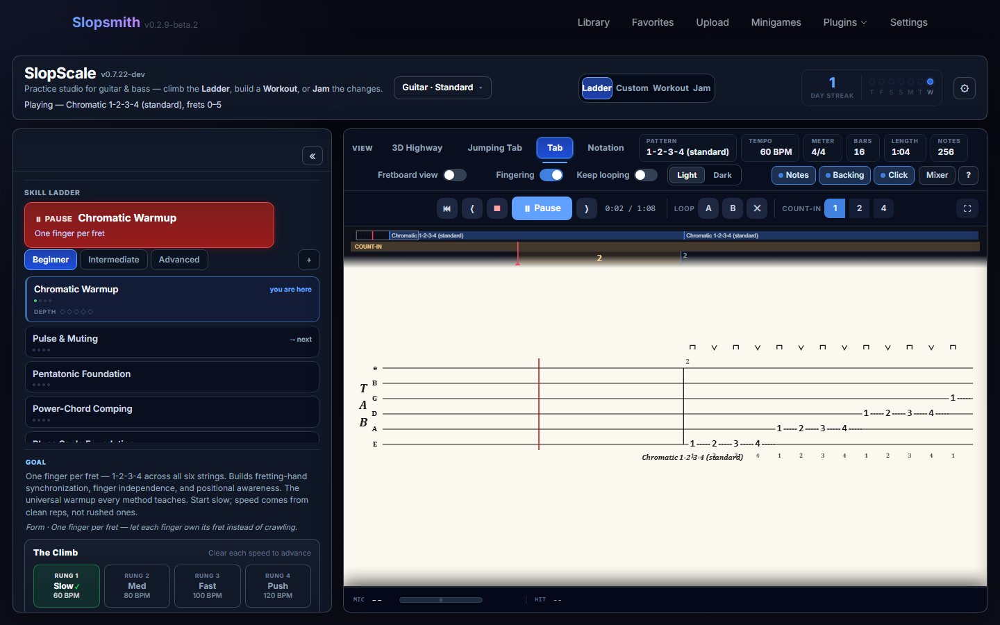
  &nbsp;
  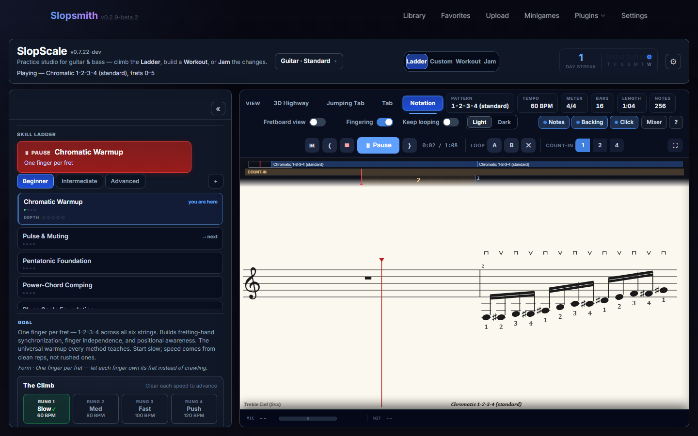
  <br><sub><i>One chart, your choice of surface: paper-style Tab and standard Notation (3D Highway shown above).</i></sub>
</p>

A docked **live fretboard strip** sits under the Tab and Notation views (toggleable), drawing the exercise's whole shape and glowing the notes as they sound. The Light/Dark toggle appears when Tab or Notation is active and persists across reloads.

## Audio

Playback is fully contained in the plugin (its own clock, Web Audio graph, and pitch tracker). The signal path is **per-track buses → a master safety limiter → output**, so stacked notes stay clean and normalised — no clipping, no surprise full-volume hits.

<p align="center">
  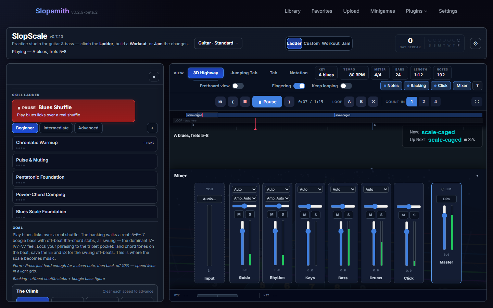
  <br><sub><i>The live Mixer (<code>M</code>) — balance or mute the practice voice, bass, comp, drums and click, swap instruments, pick an <b>amp</b> (Clean / Overdrive / Metal) for the guide and rhythm guitars, or dim the backing, all while you play.</i></sub>
</p>

- **Practice voice** — sampled, at the actual string/fret pitches; the oscillator voice is the fallback so you're never left silent on a cold load
- **Backing band** — sampled comp + bass voiced per progression step (key-aware voicing engine), plus the new drum voice
- **Drums** — a `drums` bus with its own compressor (before the master); kits are chosen per style/feel and pieces are humanised so it doesn't read as a drum machine. Drums stay silent through the count-in and enter on the downbeat
- **Metronome** — accent on beat 1, group accents that follow the meter's grouping (3+2+2 vs 2+2+3 for 7/8, etc.)
- **Per-style sound** — an audio-profile system maps a genre to a tone/brightness, overridable from the Mixer

## Configuration

Dial in anything — 12 keys, 25+ scales, any tuning, any meter, any feel — or let a Ladder routine set it all for you. The full menus:

### Key & scale
12 keys; 25+ scale families: major, natural / harmonic / melodic minor, the seven modes of major, the melodic-minor modes (Dorian ♭2, Lydian augmented, Lydian dominant, Mixolydian ♭6, Locrian ♮2, altered), minor & major pentatonic, blues, bebop major & dominant, whole-tone, diminished, Phrygian dominant, plus exotic colours (double harmonic, Hungarian minor, Neapolitan minor) for the metal/idiom work.

### Instruments & tuning
- **Guitar** — 6 / 7 / 8 strings: Standard, Drop D, Eb / D Standard, DADGAD, Open G/D, Drop A (7), Drop E (8)
- **Bass** — 4 / 5 / 6 strings: Standard, Drop D, Eb, BEAD, high-C tenor, Drop A. Bass uses a single movable position box (CAGED/3NPS are guitar artifacts and are hidden on bass — by design)
- **Custom tuning** — per-string note inputs (`E2`, `F#3`, `Bb4`…); **+ Save tuning…** persists it under a name in the host DB
- **Piano** — UI scaffolded; keyboard generators are a future phase

### Tempo, meter & feel
30–260 BPM · 4/4, 3/4, 6/8, 7/8 (2+2+3 or 3+2+2), 5/4 · quarter / eighth / sixteenth / triplet subdivisions · straight / swing / shuffle feel · count-in None / 1 / 2 / 4 bars.

### Practice types
Scale patterns · chord-scales (mode-of-the-moment or chord-tone emphasis) · diatonic arpeggios · progression arpeggios · sweep arpeggios (HOPO turnaround) · chromatic warmups · guide tones · and a deep **technique/vocabulary** library (legato, bends, vibrato, scale in 3rds/6ths, call-and-response, tremolo, tapping, pedal point, string skipping, position shifts, rhythmic displacement, chromatic enclosures, bebop scale, arpeggio inversions, walking bass, hybrid picking, triadic pairs, pentatonic superimposition, shell voicings, octave displacement, the metal pedal-riff / gallop / herta-chug / twin-lead primitives, **strumming / comping**, the **fingerstyle set** — p-i-m-a broken chords + the two-string spider, and the **bass groove set** — root–5th–octave, octave groove, dead-note pocket, slap & pop, right-hand technique).

### Fretboard systems
CAGED position (auto fret-window per key + shape) · CAGED single-shape (strict-ascend or closest-position) · 3-notes-per-string (seven modal positions) · open position · manual position box · single-string run · full-neck map. Shapes are **degree-driven** with a no-unison guarantee — a run never sounds the same pitch twice across strings.

### Harmony engine
Diatonic progressions, the common pop/jazz/blues sets, minor ii–V–i, 12-bar & quick-change blues, and a **jazz harmony engine**: chord depth (power / triad / seventh / 9·11·13 / 6 / m6 / 6-9 / sus / m(maj7)), auto-diatonic stacking with correct altered tensions, **tritone substitution**, and a voicing engine that turns a full interval stack into a *playable, musical* voicing rather than stacking every formula note.

## Persistence
- **Save preset** — full config to the host SQLite DB (`virtuoso_presets`)
- **Save tuning** — custom tunings to `virtuoso_tunings`, shown under "Saved" every session
- **Share link** — the whole form state encodes into a URL hash; paste a link to land on the exact same exercise

> **Upgrading FeedBack Desktop?** Some Desktop upgrades advise deleting the config folder. Your **presets & tunings** live in the host DB and survive (and can be **Settings → Export**ed/Imported), but your **Skill-Ladder progress, installed packs, mixer and preferences** live in browser localStorage and are cleared by a config wipe. **Export your settings first** if you want to keep them. (Ladder progress isn't yet in the export — on the roadmap.)

## Quick start

### Prerequisites
- A working FeedBack install (web/Docker or Desktop)
- Write access to FeedBack's `plugins/` directory

### Install (FeedBack web/Docker)
```bash
cd /path/to/feedback/plugins
git clone https://github.com/got-feedback/feedBack-plugin-virtuoso.git virtuoso
docker compose restart
```

### Install (FeedBack Desktop)
Clone into the Desktop app's configured plugins directory (visible in **Settings → Plugins**).

> **Note:** Don't clone into a protected/admin install path (e.g. anything under `C:\Program Files\…`) — Windows write-protects it. Use the user-writable plugins directory the Desktop app reports in Settings.

After restart, **Virtuoso** appears in the plugin navigation.

### First five minutes
Open **Virtuoso → Ladder**, pick a beginner node (e.g. *Pentatonic Foundation*), and hit **Play** — you're drilling. Then switch to **Jam**: pick a style, press play, and noodle over the band while the fretboard strip shows you the notes to land on. That's the whole loop — drill a skill, then go use it.

## File layout

| File | Purpose |
|------|---------|
| `plugin.json` | FeedBack plugin manifest |
| `screen.html` | Plugin UI (markup + inline styles + bootstrap) |
| `screen.js` | Generators, pathways, renderers, audio engine, mixer, and host integration |
| `routes.py` | DB-backed preset + tuning persistence; self-hosted audio asset routes |
| `settings.html` | Plugin settings / info panel |
| `static/` | Self-hosted audio assets (`wafonts/` sampler + drum kits) served by `routes.py` |
| `docs/` | Architecture, exercise schema, pedagogy, theory knowledge base, and design notes |

## Roadmap

- **Structured multi-week Programs** — a guided arc of Workouts toward a named goal (the practice-gym layer that measures and remembers is in; the multi-session container is next)
- Deeper drum realism (per-genre grooves + humanisation) and a brush/percussion kit set
- Per-instrument **Skill Ladder** content (guitar Core + Concept/genre packs, and an **instrument-aware bass Core with a felt-hold pocket verdict**, shipped; **piano** to follow)
- Live amp-modelled distorted backing (host NAM-engine borrow, in progress)
- Piano / keyboard exercise generation

## License

Copyright (C) 2026 Christian Cowan.

Virtuoso is free software, licensed under the [GNU Affero General Public License v3.0](LICENSE) (AGPL-3.0-only): you may use, study, modify, and share it — and anything you build on it (including running it as a service) must stay open under the same terms.
